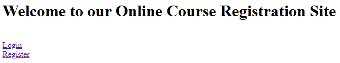
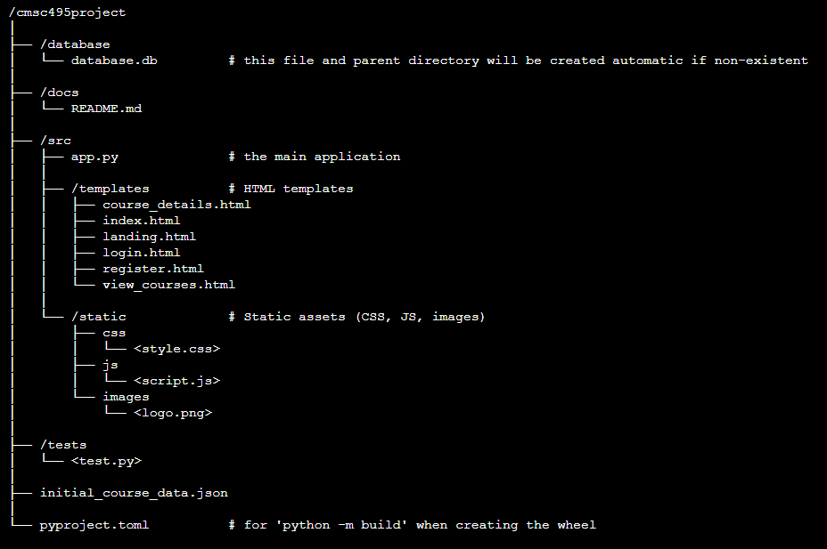
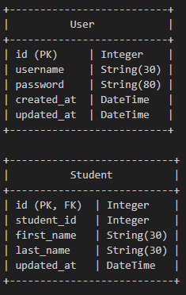

# Online Course Registration 

Our project will simplify the course registration process, allowing students to easily browse available courses, view detailed information, and register with just a few clicks. However, these features are accessible only after the student has successfully completed a secure login or registration process.  

# Installation Pasta

apt install python3.13 python3.13-venv python3.13-dev  
sudo rm /usr/bin/python3; sudo ln -s /usr/bin/python3.13 /usr/bin/python3        
cd; python3 -m venv .venv495     
source ~/.venv495/bin/activate    
python3 -m ensurepip --upgrade    
pip install cmsc495project*.whl     
sudo cmsc495    

# Package Directory Structure

# Database Commands
sqlite3 ../database/database.db  
.tables  
select * from user;  
select * from student;  
.exit  

# Database Tables
